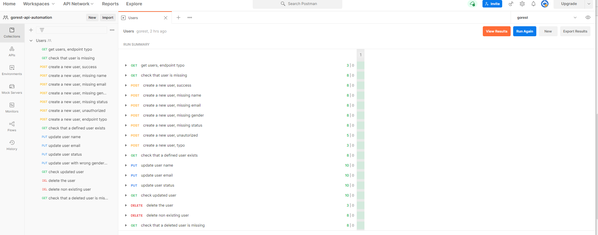

# gorest_api_automation

For testing purpose it was chosen the following service [https://gorest.co.in](https://gorest.co.in/) <br/>
The endpoint used for postman collection [/public/v1/users](https://gorest.co.in/public/v1/users) <br/>

### Requirements
2. API automation
   1. Use https://gorest.co.in/
   2. Choose one of available endpoints
   3. Automate the testing of endpoint via a Postman collection(s)
   4. Provide the readme to the solution
   5. Upload the solution to a private repo on either gitlab or github

### Resources
Postman.exe for Windows | https://www.postman.com/downloads/ <br/>
Postman collection | https://www.postman.com/collection/ <br/>
Postman tests | https://learning.postman.com/docs/writing-scripts/test-scripts/ <br/>
Postman github integration | https://blog.postman.com/backup-and-sync-your-postman-collections-on-github/ <br/>

### Collection description
1. Created a new authentication token using the following instractions [https://gorest.co.in/access-token](https://gorest.co.in/access-token)
   1. used github as an authentication provider
2. Created a new postman workspace "gorest-api-automation"
3. Created a new postman collection "Users"
   1. Added token as collection variable "token": "<token>"
   2. Added "missing_user_id": 99999 as a collection variable
   3. Created a before all script in Pre-request script that generates a random "name" and store it in `"first_new_name"` collection variable
4. Created a new postman environment "gorest"
   1. Added "base_url": "https://gorest.co.in" as environment variable
5. Created Header Presets named "Default Headers" with following: "Content-Type": "application/json" and "Authorization": "Bearer {{token}}"
6. Created the following REST Requests:
	<details>
		<summary>Click to expand Requests description</summary>

		1. "get users, endpoint typo" `GET {{base_url}}/public/v1/uusers`
			1. Tests [ref1]
		2. "check that user is missing" `GET {{base_url}}/public/v1/users`
			1. Tests [ref2]
		3. "create a new user, success" `POST {{base_url}}/public/v1/users`
			1. Pre-request script that sets the `post_body_data` and `first_new_email` as collection variables 
			2. Body: get body from collection variable `{{post_data}}`
			3. `{{user_id}}` and `{{response_body}}` are set as collection variables
			4. Tests: [ref3]
		4. "create a new user, missing name" `POST {{base_url}}/public/v1/users`
			1. Body: `{"name": "","email": "{{first_new_email}}","gender": "male","status": "active"}`
			2. Tests: [ref4]
		5. "create a new user, missing gender" `POST {{base_url}}/public/v1/users`
			1. Body: `{"name": "{{first_new_name}}","email": "{{first_new_email}}","gender": "","status": "active"}`
			2. Tests: [ref5]
		6. "create a new user, missing status" `POST {{base_url}}/public/v1/users`
			1. Body: `{"name": "{{first_new_name}}","email": "{{first_new_email}}","gender": "male","status": ""}`
			2. Tests: [ref6]
		7. "create a new user, unauthorized" ` POST {{base_url}}/public/v1/users`
			1. Removed the "Authorization" header
			2. Body: is get from `{{post_data}}` collection variable
			3. Tests: [ref7]
		8. "check that a defined user exists" `GET {{base_url}}/public/v1/users/{{user_id}}`
			1. `{{user_id}}` is get from collection variables
			2. Tests: [ref9]
		9. "update user name" `PUT {{base_url}}/public/v1/users/{{user_id}}`
			1. Body `{"name": "{{second_new_name}}","email": "{{first_new_email}}","gender": "male","status": "active"}`
			2. Pre-request script: set collection variable `{{second_new_name}}`
			3. Tests: [ref10]
		10. "update user email" `PUT {{base_url}}/public/v1/users/{{user_id}}`
			1. Body: `{"name": "{{second_new_name}}","email": "{{second_new_email}}","gender": "male","status": "active"}`
			2. Pre-request script: set set collection variable `{{ second_new_email}}`
			3. Tests: [ref11]
		11. "update user status" `PUT {{base_url}}/public/v1/users/{{user_id}}`
			1. Body `{"name": "{{second_new_name}}","email": "{{second_new_email}}","gender": "male","status": "inactive"}`
			2. Tests: [ref12]
		12. "update user with wrong gender type data" `PUT {{base_url}}/public/v1/users/{{user_id}}`
			1. Body: `{"name": "{{second_new_name}}","email": "{{second_new_email}}","gender": 1,"status": "inactive"}`
			2. Tests: [ref13]
		13. "check updated user" `GET {{base_url}}/public/v1/users/{{user_id}}`
			1. Tests [ref14]
		14. "delete the user" `DELETE {{base_url}}/public/v1/users/{{user_id}}`
			1. Tests: [ref15]
		15. "delete non existing user" `DELETE {{base_url}}/public/v1/users/{{missing_user}}`
			1. Tests: [ref16]
		16. "check that a deleted user is missing" `GET {{base_url}}/public/v1/users/{{user_id}}`
			1. Tests: [ref17]
	</details>


### Tests
<details>
    <summary>click to expand [ref1]</summary>

    ```
    // Defining expected status code
    const expectedStatusCode = 404
    
    // Definning expected status code name 
    const expectedStatusCodeName = 'Not Found';
    
    
    pm.test(`Response status code is "${expectedStatusCode}"`, () => {
        pm.response.to.have.status(expectedStatusCode);
    });
    
    pm.test("response should have error", () => {
        pm.response.to.be.error;
    });
    
    
    pm.test("response body should not be json", () => {
        pm.response.to.not.be.json;
    });
    
    pm.test("Content-Type is present", () => {
        pm.response.to.have.header("Content-Type");
    });
    ```
</details>
<details>
    <summary>click to expand [ref2]</summary>

    ```
    // Get expected name from collection variable
    const expectedName = pm.collectionVariables.get("first_new_name");
    
    // Defining responseJson variable which contains response body json
    const responseJson = pm.response.json();
    
    // Defining expected status code
    const expectedStatusCode = 200
    
    // Definning expected status code name 
    const expectedStatusCodeName = 'OK';
    
    
    pm.test(`Response status code is "${expectedStatusCode}"`, () => {
        pm.response.to.have.status(expectedStatusCode);
    });
    
    pm.test("response should not have error", () => {
        pm.response.to.not.be.error;
    });
    
    pm.test("response should be with body", () => {
        pm.response.to.be.withBody;
    });
    
    pm.test("response body should be json", () => {
        pm.response.to.be.json;
    });
    
    pm.test(`response body should have "meta" propery`, () => {
        pm.expect(responseJson).to.have.property("meta");
    });
    
    pm.test(`response body should have "data" propery`, () => {
        pm.expect(responseJson).to.have.property("data");
    });
    
    pm.test(`status code name should be "${expectedStatusCodeName}"`, () => {
        pm.response.to.have.status(expectedStatusCodeName);
    });
    
    pm.test(`user with name "${expectedName}" does not exist`, () => {
        responseJson.data.forEach((property) => {
            pm.expect(property.name).to.not.equal(expectedName);
        });
    });
    
    pm.test("Content-Type is present", () => {
        pm.response.to.have.header("Content-Type");
    });
    ```
</details>
<details>
    <summary>click to expand [ref3]</summary>

    ```
	// Defining responseJson variable which contains response body json
	const responseJson = pm.response.json();
	
	// Set user id collection variable 
	pm.collectionVariables.set("user_id", responseJson.data.id)
	
	// Set response body collection variable 
	pm.collectionVariables.set("response_body", JSON.stringify(responseJson.data))
	
	// Defining expected status code
	const expectedStatusCode = 201
	
	// Definning expected status code name 
	const expectedStatusCodeName = 'Created';
	
	// Test status code name
	pm.test(`status code name should be "${expectedStatusCodeName}"`, () => {
		pm.response.to.have.status(expectedStatusCodeName);
	});
	
	// Test status code
	pm.test(`response status code should be "${expectedStatusCode}"`, () => {
		pm.response.to.have.status(expectedStatusCode);
	});
	
	pm.test("response should not have error", () => {
		pm.response.to.not.be.error;
	});
	
	pm.test("response should be with body", () => {
		pm.response.to.be.withBody;
	});
	
	pm.test("response body should be json", () => {
		pm.response.to.be.json;
	});
	
	pm.test(`response body should have "meta" propery`, () => {
		pm.expect(responseJson).to.have.property("meta");
	});
	
	pm.test(`response body should have "data" propery`, () => {
		pm.expect(responseJson).to.have.property("data");
	});
	
	// compare request and response body data
	pm.test(`Request body and response body should be identical`, () => {
		delete responseJson.data.id
		const isEqual = _.isEqual(responseJson.data, JSON.parse(pm.collectionVariables.get("post_data")));
		pm.expect(isEqual).to.be.true;
	});
	
	pm.test("Content-Type is present", () => {
		pm.response.to.have.header("Content-Type");
	});
	
	```
</details>
<details>
    <summary>click to expand [ref4]</summary>

    ```
	// Defining responseJson variable which contains response body json
	const responseJson = pm.response.json();
	
	// Defining expected status code
	const expectedStatusCode = 422
	
	// Definning expected status code name 
	const expectedStatusCodeName = 'Unprocessable Entity';
	
	// Test status code name
	pm.test(`status code name should be "${expectedStatusCodeName}"`, () => {
		pm.response.to.have.status(expectedStatusCodeName);
	});
	
	// Test status code
	pm.test(`response status code should be "${expectedStatusCode}"`, () => {
		pm.response.to.have.status(expectedStatusCode);
	});
	
	pm.test("response should not have error", () => {
		pm.response.to.be.error;
	});
	
	pm.test("response should be with body", () => {
		pm.response.to.be.withBody;
	});
	
	pm.test("response body should be json", () => {
		pm.response.to.be.json;
	});
	
	pm.test(`response body should have "meta" propery`, () => {
		pm.expect(responseJson).to.have.property("meta");
	});
	
	pm.test(`response body should have "data" propery`, () => {
		pm.expect(responseJson).to.have.property("data");
	});
	
	// compare request and response body data
	pm.test(`response 'data.field="name"' should have message "can't be blank"`, () => {
		pm.expect(responseJson.data[0]).to.have.property("field");
		pm.expect(responseJson.data[0].field).to.equal("name");
		pm.expect(responseJson.data[0].message).to.equal("can't be blank");
	});
	
	pm.test("Content-Type is present", () => {
		pm.response.to.have.header("Content-Type");
	});
	```
</details>
<details>
    <summary>click to expand [ref5]</summary>

    ```
	// Defining responseJson variable which contains response body json
	const responseJson = pm.response.json();

	// Defining expected status code
	const expectedStatusCode = 422

	// Definning expected status code name 
	const expectedStatusCodeName = 'Unprocessable Entity';

	// Test status code name
	pm.test(`status code name should be "${expectedStatusCodeName}"`, () => {
    		pm.response.to.have.status(expectedStatusCodeName);
	});

	// Test status code
	pm.test(`response status code should be "${expectedStatusCode}"`, () => {
    		pm.response.to.have.status(expectedStatusCode);
	});

	pm.test("response should not have error", () => {
    		pm.response.to.be.error;
	});

	pm.test("response should be with body", () => {
    		pm.response.to.be.withBody;
	});

	pm.test("response body should be json", () => {
    		pm.response.to.be.json;
	});

	pm.test(`response body should have "meta" propery`, () => {
    		pm.expect(responseJson).to.have.property("meta");
	});

	pm.test(`response body should have "data" propery`, () => {
    		pm.expect(responseJson).to.have.property("data");
	});

	// compare request and response body data
	pm.test(`response 'data.field="email"' should have message "can't be blank"`, () => {
    		pm.expect(responseJson.data[0]).to.have.property("field");
    		pm.expect(responseJson.data[0].field).to.equal("email");
    		pm.expect(responseJson.data[0].message).to.equal("can't be blank");
	});

	pm.test("Content-Type is present", () => {
    		pm.response.to.have.header("Content-Type");
	});
	```
</details>
<details>
    <summary>click to expand [ref6]</summary>

    ```
	// Defining responseJson variable which contains response body json
	const responseJson = pm.response.json();
	
	// Defining expected status code
	const expectedStatusCode = 422
	
	// Definning expected status code name 
	const expectedStatusCodeName = 'Unprocessable Entity';
	
	// Test status code name
	pm.test(`status code name should be "${expectedStatusCodeName}"`, () => {
		pm.response.to.have.status(expectedStatusCodeName);
	});
	
	// Test status code
	pm.test(`response status code should be "${expectedStatusCode}"`, () => {
		pm.response.to.have.status(expectedStatusCode);
	});
	
	pm.test("response should not have error", () => {
		pm.response.to.be.error;
	});
	
	pm.test("response should be with body", () => {
		pm.response.to.be.withBody;
	});
	
	pm.test("response body should be json", () => {
		pm.response.to.be.json;
	});
	
	pm.test(`response body should have "meta" propery`, () => {
		pm.expect(responseJson).to.have.property("meta");
	});
	
	pm.test(`response body should have "data" propery`, () => {
		pm.expect(responseJson).to.have.property("data");
	});
	
	// compare request and response body data
	pm.test(`response 'data.field="gender"' should have message "can't be blank"`, () => {
		pm.expect(responseJson.data[0]).to.have.property("field");
		pm.expect(responseJson.data[0].field).to.equal("gender");
		pm.expect(responseJson.data[0].message).to.equal("can't be blank");
	});
	
	pm.test("Content-Type is present", () => {
		pm.response.to.have.header("Content-Type");
	});
	```
</details>
<details>
    <summary>click to expand [ref7]</summary>

    ```
	// Defining responseJson variable which contains response body json
	const responseJson = pm.response.json();
	
	// Defining expected status code
	const expectedStatusCode = 401
	
	// Definning expected status code name 
	const expectedStatusCodeName = 'Unauthorized';
	
	
	pm.test(`response status code is "${expectedStatusCode}"`, () => {
		pm.response.to.have.status(expectedStatusCode);
	});
	
	pm.test("response should have error", () => {
		pm.response.to.be.error;
	});
	
	
	pm.test("response body should not be json", () => {
		pm.response.to.be.json;
	});
	
	pm.test("response should be with body", () => {
		pm.response.to.be.withBody;
	});
	
	pm.test("response body should be json", () => {
		pm.response.to.be.json;
	});
	
	pm.test("Content-Type is present", () => {
		pm.response.to.have.header("Content-Type");
	});
	
	pm.test(`response 'data' should have message "Authentication failed"`, () => {
		pm.expect(responseJson.data.message).to.equal("Authentication failed");
	});
	```
</details>
<details>
    <summary>click to expand [ref8]</summary>

    ```
	// Get post body object collection variable
	const post_body = JSON.parse(pm.collectionVariables.get("response_body"));
	// Defining responseJson variable which contains response body json
	const responseJson = pm.response.json();
	
	// Defining expected name variable
	const expectedName = post_body.name;
	
	// Defining expected status code
	const expectedStatusCode = 200
	
	// Definning expected status code name 
	const expectedStatusCodeName = 'OK';
	
	
	pm.test(`Response status code is "${expectedStatusCode}"`, () => {
		pm.response.to.have.status(expectedStatusCode);
	});
	
	pm.test("response should not have error", () => {
		pm.response.to.not.be.error;
	});
	
	pm.test("response should be with body", () => {
		pm.response.to.be.withBody;
	});
	
	pm.test("response body should be json", () => {
		pm.response.to.be.json;
	});
	
	pm.test(`response body should have "meta" propery`, () => {
		pm.expect(responseJson).to.have.property("meta");
	});
	
	pm.test(`response body should have "data" propery`, () => {
		pm.expect(responseJson).to.have.property("data");
	});
	
	pm.test(`status code name should be "${expectedStatusCodeName}"`, () => {
		pm.response.to.have.status(expectedStatusCodeName);
	});
	
	pm.test('check newly created user', () => {
		const isEqual = _.isEqual(post_body, responseJson.data);
		pm.expect(isEqual).to.be.true;
	});
	```
</details>
<details>
    <summary>click to expand [ref9]</summary>

    ```
	// Defining responseJson variable which contains response body json
	const responseJson = pm.response.json();
	
	// Get collection variables
	const name = pm.collectionVariables.get("second_new_name");
	const email = pm.collectionVariables.get("first_new_email");
	const user_id = pm.collectionVariables.get("user_id");
	
	// Defining expected status code
	const expectedStatusCode = 200
	
	// Definning expected status code name 
	const expectedStatusCodeName = 'OK';
	
	
	pm.test(`Response status code is "${expectedStatusCode}"`, () => {
		pm.response.to.have.status(expectedStatusCode);
	});
	
	pm.test("response should not have error", () => {
		pm.response.to.not.be.error;
	});
	
	pm.test("response should be with body", () => {
		pm.response.to.be.withBody;
	});
	
	pm.test("response body should be json", () => {
		pm.response.to.be.json;
	});
	
	pm.test(`response body should have "meta" propery`, () => {
		pm.expect(responseJson).to.have.property("meta");
	});
	
	pm.test(`response body should have "data" propery`, () => {
		pm.expect(responseJson).to.have.property("data");
	});
	
	pm.test(`user name should be "${name}"`, () => {
		pm.expect(responseJson.data.name).to.eql(name);
	});
	
	pm.test(`user email should be "${email}"`, () => {
		pm.expect(responseJson.data.email).to.eql(email);
	});
	
	pm.test(`user status should be "active"`, () => {
		pm.expect(responseJson.data.status).to.eql("active");
	});
	
	pm.test(`user id should be "${user_id}"`, () => {
		pm.expect(responseJson.data.id).to.eql(user_id);
	});
	
	pm.test("Content-Type is present", () => {
		pm.response.to.have.header("Content-Type");
	});
	```
</details>
<details>
    <summary>click to expand [ref10]</summary>

    ```
	// Defining responseJson variable which contains response body json
	const responseJson = pm.response.json();
	
	// Get collection variables
	const name = pm.collectionVariables.get("second_new_name");
	const email = pm.collectionVariables.get("second_new_email");
	const user_id = pm.collectionVariables.get("user_id");
	
	// Defining expected status code
	const expectedStatusCode = 200
	
	// Definning expected status code name 
	const expectedStatusCodeName = 'OK';
	
	
	pm.test(`Response status code is "${expectedStatusCode}"`, () => {
		pm.response.to.have.status(expectedStatusCode);
	});
	
	pm.test("response should not have error", () => {
		pm.response.to.not.be.error;
	});
	
	pm.test("response should be with body", () => {
		pm.response.to.be.withBody;
	});
	
	pm.test("response body should be json", () => {
		pm.response.to.be.json;
	});
	
	pm.test(`response body should have "meta" propery`, () => {
		pm.expect(responseJson).to.have.property("meta");
	});
	
	pm.test(`response body should have "data" propery`, () => {
		pm.expect(responseJson).to.have.property("data");
	});
	
	pm.test(`user name should be "${name}"`, () => {
		pm.expect(responseJson.data.name).to.eql(name);
	});
	
	pm.test(`user email should be "${email}"`, () => {
		pm.expect(responseJson.data.email).to.eql(email);
	});
	
	pm.test(`user status should be "active"`, () => {
		pm.expect(responseJson.data.status).to.eql("active");
	});
	
	pm.test(`user id should be "${user_id}"`, () => {
		pm.expect(responseJson.data.id).to.eql(user_id);
	});
	
	pm.test("Content-Type is present", () => {
		pm.response.to.have.header("Content-Type");
	});
	```
</details>
<details>
    <summary>click to expand [ref11]</summary>

    ```
	// Defining responseJson variable which contains response body json
	const responseJson = pm.response.json();
	
	const name = pm.collectionVariables.get("second_new_name");
	const email = pm.collectionVariables.get("second_new_email");
	const user_id = pm.collectionVariables.get("user_id");
	
	// Defining expected status code
	const expectedStatusCode = 200
	
	// Definning expected status code name 
	const expectedStatusCodeName = 'OK';
	
	
	pm.test(`Response status code is "${expectedStatusCode}"`, () => {
		pm.response.to.have.status(expectedStatusCode);
	});
	
	pm.test("response should not have error", () => {
		pm.response.to.not.be.error;
	});
	
	pm.test("response should be with body", () => {
		pm.response.to.be.withBody;
	});
	
	pm.test("response body should be json", () => {
		pm.response.to.be.json;
	});
	
	pm.test(`response body should have "meta" propery`, () => {
		pm.expect(responseJson).to.have.property("meta");
	});
	
	pm.test(`response body should have "data" propery`, () => {
		pm.expect(responseJson).to.have.property("data");
	});
	
	pm.test(`user name should be "${name}"`, () => {
		pm.expect(responseJson.data.name).to.eql(name);
	});
	
	pm.test(`user email should be "${email}"`, () => {
		pm.expect(responseJson.data.email).to.eql(email);
	});
	
	pm.test(`user status should be "inactive"`, () => {
		pm.expect(responseJson.data.status).to.eql("inactive");
	});
	
	pm.test(`user id should be "${user_id}"`, () => {
		pm.expect(responseJson.data.id).to.eql(user_id);
	});
	
	pm.test("Content-Type is present", () => {
		pm.response.to.have.header("Content-Type");
	});
	```
</details>
<details>
    <summary>click to expand [ref12]</summary>

    ```
	// Defining responseJson variable which contains response body json
	const responseText = pm.response.text();
	console.log(responseText.split('\n')[1])
	
	const name = pm.collectionVariables.get("second_new_name");
	const email = pm.collectionVariables.get("second_new_email");
	const user_id = pm.collectionVariables.get("user_id");
	
	// Defining expected status code
	const expectedStatusCode = 500
	
	// Definning expected status code name 
	const expectedStatusCodeName = 'Internal Server Error';
	
	
	pm.test(`Response status code is "${expectedStatusCode}"`, () => {
		pm.response.to.have.status(expectedStatusCode);
	});
	
	pm.test("response should not have error", () => {
		pm.response.to.be.error;
	});
	
	pm.test("response should be with body", () => {
		pm.response.to.be.withBody;
	});
	
	pm.test("Content-Type is present", () => {
		pm.response.to.have.header("Content-Type");
	});
	```
</details>
<details>
    <summary>click to expand [ref13]</summary>

    ```
	// Defining responseJson variable which contains response body json
	const responseJson = pm.response.json();
	
	// Get collection variables
	const name = pm.collectionVariables.get("second_new_name");
	const email = pm.collectionVariables.get("second_new_email");
	
	// Defining expected status code
	const expectedStatusCode = 200
	
	// Definning expected status code name 
	const expectedStatusCodeName = 'OK';
	
	
	pm.test(`Response status code is "${expectedStatusCode}"`, () => {
		pm.response.to.have.status(expectedStatusCode);
	});
	
	pm.test("response should not have error", () => {
		pm.response.to.not.be.error;
	});
	
	pm.test("response should be with body", () => {
		pm.response.to.be.withBody;
	});
	
	pm.test("response body should be json", () => {
		pm.response.to.be.json;
	});
	
	pm.test(`response body should have "meta" propery`, () => {
		pm.expect(responseJson).to.have.property("meta");
	});
	
	pm.test(`response body should have "data" propery`, () => {
		pm.expect(responseJson).to.have.property("data");
	});
	
	pm.test(`status code name should be "${expectedStatusCodeName}"`, () => {
		pm.response.to.have.status(expectedStatusCodeName);
	});
	
	pm.test(`user should have name "${name}"`, () => {
		pm.expect(responseJson.data.name).to.equal(name);
	});
	
	pm.test(`user should have email "${email}"`, () => {
		pm.expect(responseJson.data.email).to.equal(email);
	});
	
	pm.test(`user should have status "inactive"`, () => {
		pm.expect(responseJson.data.status).to.equal("inactive");
	});
	
	pm.test("Content-Type is present", () => {
		pm.response.to.have.header("Content-Type");
	});
	```
</details>
<details>
    <summary>click to expand [ref14]</summary>

    ```
	// Defining expected status code
	const expectedStatusCode = 204
	
	// Definning expected status code name 
	const expectedStatusCodeName = 'No Content';
	
	
	pm.test(`Response status code is "${expectedStatusCode}"`, () => {
		pm.response.to.have.status(expectedStatusCode);
	});
	
	pm.test("response should not have error", () => {
		pm.response.to.not.be.error;
	});
	
	pm.test("response should be with body", () => {
		pm.response.to.not.be.withBody;
	});
	
	pm.test("Content-Type is present", () => {
		pm.response.to.have.header("Content-Type");
	});
	```
</details>
<details>
    <summary>click to expand [ref15]</summary>

    ```
	// Defining responseJson variable which contains response body json
	const responseJson = pm.response.json();
	
	// Defining expected status code
	const expectedStatusCode = 404
	
	// Definning expected status code name 
	const expectedStatusCodeName = 'Not Found';
	
	
	pm.test(`response status code is "${expectedStatusCode}"`, () => {
		pm.response.to.have.status(expectedStatusCode);
	});
	
	pm.test("response should not have error", () => {
		pm.response.to.be.error;
	});
	
	pm.test("response should be with body", () => {
		pm.response.to.be.withBody;
	});
	
	pm.test("response body should be json", () => {
		pm.response.to.be.json;
	});
	
	pm.test(`response body should have "meta" propery`, () => {
		pm.expect(responseJson).to.have.property("meta");
	});
	
	pm.test(`response body should have "data" propery`, () => {
		pm.expect(responseJson).to.have.property("data");
	});
	
	pm.test(`response body should have "message" propery`, () => {
		pm.expect(responseJson.data).to.have.property("message");
	});
	
	pm.test("user should not be found", () => {
		pm.expect(responseJson.data.message).to.eql("Resource not found");
	});
	
	pm.test("Content-Type is present", () => {
		pm.response.to.have.header("Content-Type");
	});
	```
</details>
<details>
    <summary>click to expand [ref16]</summary>

    ```
	// Get post body object collection variable
	const post_body = JSON.parse(pm.collectionVariables.get("post_data"));
	
	// Defining responseJson variable which contains response body json
	const responseJson = pm.response.json();
	
	// Defining expected name variable
	const expectedName = post_body.name;
	
	// Defining expected status code
	const expectedStatusCode = 404
	
	// Definning expected status code name 
	const expectedStatusCodeName = 'No Found';
	
	
	pm.test(`response status code is "${expectedStatusCode}"`, () => {
		pm.response.to.have.status(expectedStatusCode);
	});
	
	pm.test("response should not have error", () => {
		pm.response.to.be.error;
	});
	
	pm.test("response should be with body", () => {
		pm.response.to.be.withBody;
	});
	
	pm.test("response body should be json", () => {
		pm.response.to.be.json;
	});
	
	pm.test(`response body should have "meta" propery`, () => {
		pm.expect(responseJson).to.have.property("meta");
	});
	
	pm.test(`response body should have "data" propery`, () => {
		pm.expect(responseJson).to.have.property("data");
	});
	
	pm.test(`response body should have "message" propery`, () => {
		pm.expect(responseJson.data).to.have.property("message");
	});
	
	pm.test("user should not be found", () => {
		pm.expect(responseJson.data.message).to.eql("Resource not found");
	});
	
	pm.test("Content-Type is present", () => {
		pm.response.to.have.header("Content-Type");
	});
	```
</details>

### Usage
1. Git clone the project locally
2. Import the collection in postman
3. Run Collection

### Screenshot

